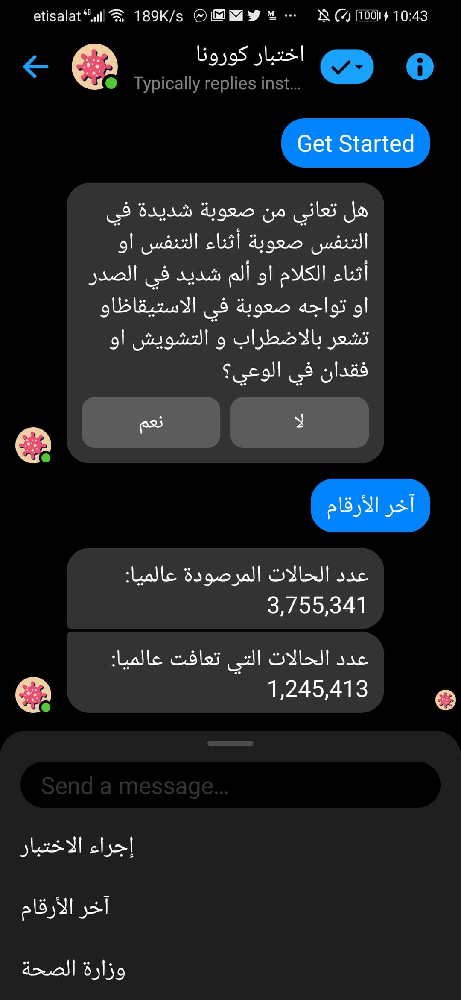

# Ektebar Corona Messenger Chatbot

Due to the COVID-19 outbreak, I created this arabic bot as a quick method to diagnose covid19.

# Solution & Goal

Offer a quick and easy way of a preliminary diagnosis, the bot also suggests a course of action according to the user's diagnosis such as contact hotlines.

# Try Out

Chat with bot here: m.me/104751974493803
FaceBook Page link: https://www.facebook.com/%D8%A7%D8%AE%D8%AA%D8%A8%D8%A7%D8%B1-%D9%83%D9%88%D8%B1%D9%88%D9%86%D8%A7-104751974493803/?modal=admin_todo_tour

    
    

    
    
    

# How to contribute & Links

If you like this project, please consider a shoutout. All contributions are welcome. Using this app will help me greatly.